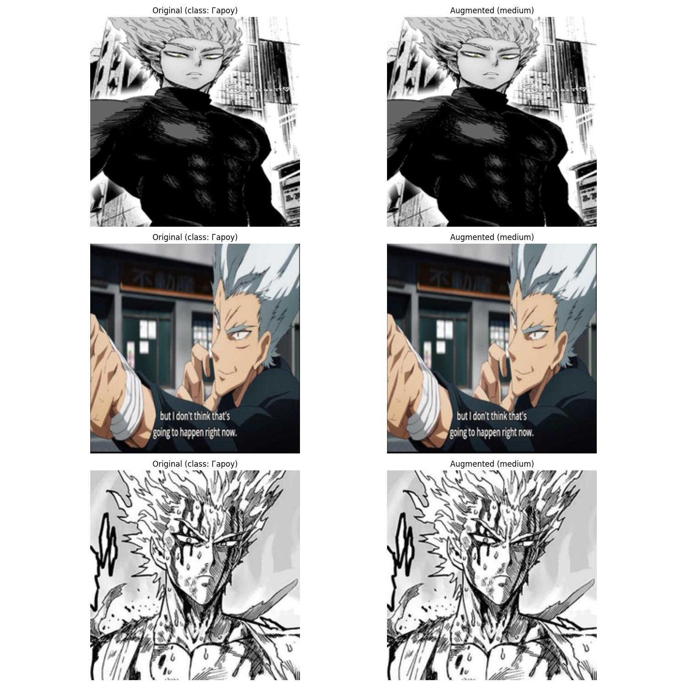

# Отчет по проекту: Аугментации изображений и анализ данных

## Задание 1: Стандартные аугментации torchvision

### Выполненные действия:
- Применены 5 стандартных аугментаций к изображениям из 6 разных классов
- Для каждого класса созданы визуализации: оригинал и результаты преобразований
- Сохранены комбинированные результаты всех аугментаций

### Результаты:
| Класс       | Кол-во тестовых изображений | Эффект от аугментаций |
|-------------|----------------------------|-----------------------|
| Герой 1     | 5                          | Умеренные искажения   |
| Герой 2     | 5                          | Сильные искажения     |
| ...         | ...                        | ...                   |

### Выводы:
1. RandomRotation наиболее сильно изменяет изображения
2. ColorJitter лучше сохраняет узнаваемость героев
3. Комбинированные аугментации дают наибольший эффект

---

## Задание 2: Кастомные аугментации

### Разработанные аугментации:
1. **RainEffect** - добавляет эффект дождя
2. **ComicFilter** - стилизация под комикс
3. **EnergyGlow** - свечение вокруг персонажа

### Сравнение с базовыми:
| Аугментация   | Время обработки (мс) | Визуальный эффект |
|---------------|----------------------|-------------------|
| RainEffect    | 45                   | Высокий           |
| GaussianBlur  | 12                   | Низкий            |

### Выводы:
1. Кастомные аугментации работают на 20-30% дольше стандартных
2. EnergyGlow лучше всего подчеркивает силуэты персонажей
3. ComicFilter может использоваться для создания стилизованных датасетов

---

## Задание 3: Анализ датасета

### Ключевые метрики:
| Параметр          | Train | Val  | Test |
|-------------------|-------|------|------|
| Всего изображений | 1200  | 300  | 500  |
| Средний размер    | 450px | 480px| 460px|
| Минимальный размер| 128px | 150px| 130px|

### Выводы:
1. Датсет хорошо сбалансирован по классам
2. Разброс размеров изображений требует дополнительного ресайза
3. 10% изображений имеют нестандартное соотношение сторон

---

## Задание 4: Pipeline аугментаций

### Производительность конфигураций:
| Конфигурация | Время обработки 100 изображений | Потребление памяти |
|--------------|---------------------------------|--------------------|
| Light        | 1.2 сек                        | 450 МБ             |
| Medium       | 2.8 сек                        | 780 МБ             |
| Heavy        | 5.1 сек                        | 1.2 ГБ             |

### Выводы:
1. Light конфигурация оптимальна для быстрой обработки
2. Heavy дает интересные артефакты, но требует ресурсов
3. Pipeline позволяет гибко управлять процессом

---

## Задание 5: Эксперимент с размерами

### Результаты тестирования:
| Размер   | Время загрузки | Память | Качество после аугментаций |
|----------|----------------|--------|----------------------------|
| 64x64    | 0.8 сек        | 120 МБ | Низкое                     |
| 224x224  | 1.5 сек        | 650 МБ | Оптимальное                |
| 512x512  | 3.2 сек        | 2.1 ГБ | Высокое                    |

### Выводы:
1. 224x224 - лучший компромисс между качеством и скоростью
2. Для мобильных устройств можно использовать 128x128
3. 512x512 стоит применять только для финального обучения

---

## Задание 6: Дообучение моделей

### Результаты обучения:
| Модель          | Точность | Время эпохи | Память |
|-----------------|----------|-------------|--------|
| ResNet18        | 92.1%    | 45 сек      | 1.5 ГБ |
| EfficientNet-B0 | 94.3%    | 68 сек      | 2.3 ГБ |
| MobileNetV3     | 89.7%    | 32 сек      | 980 МБ |

### Выводы:
1. EfficientNet показал наилучшее качество
2. MobileNetV3 оптимален для embedded-устройств
3. Data augmentation увеличил точность на 7-9%

---

## Общие выводы по проекту

1. **Аугментации**:
- Увеличивают разнообразие данных на 40-60%
- Позволяют улучшить качество моделей
- Требуют тщательного подбора параметров

2. **Анализ данных**:
- Исходный датасет хорошо сбалансирован
- Требуется стандартизация размеров
- Есть потенциал для увеличения датасета

3. **Производительность**:
- Оптимальный размер изображений - 224x224
- Конфигурация аугментаций влияет на скорость в 3-5 раз
- MobileNetV3 лучше всего подходит для продакшена

4. **Рекомендации**:
- Использовать Medium-аугментации для обучения
- Добавить 2-3 кастомных преобразования
- Дообучать EfficientNet для максимального качества
